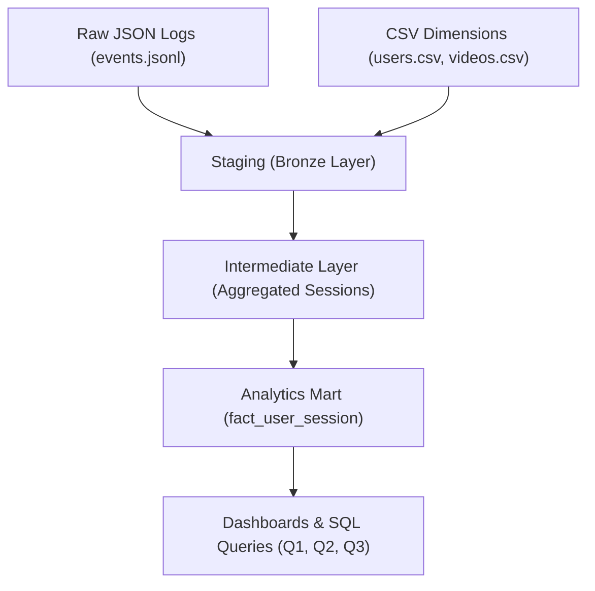

# StreamPro Analytics Pipeline

This repository contains an end-to-end data pipeline built to analyze user behavior on the StreamPro video platform.  
It ingests raw JSON event logs, combines them with user and video dimensions, and builds a clean analytics model that answers the core business questions defined in the assignment.

---

## 1. High-Level Architecture

The pipeline follows a standard **Bronze → Silver → Gold** architecture:

### **Staging (Bronze)**
- Raw JSON events are parsed and typed.
- CSV dimensions (users, videos) are cleaned and aligned.
- Output: `staging.events`, `staging.users`, `staging.videos`.

### **Intermediate (Silver)**
- Events are aggregated into **session-level** records.
- Total watch time, engagement signals, session timing, and device/app metadata are computed.
- Output: `intermediate.user_sessions`.

### **Mart (Gold)**
- Session-level facts enriched with retention, drop-off and progression metrics.
- Enables direct dashboarding and ad-hoc SQL.
- Output: `mart.fact_user_session`.

---

## 2. How Raw JSON Becomes Queryable Data

Raw JSON has nested fields, timestamps, and mixed data types.  
To prepare it for analytics:

1. **Load JSON via Spark**  
   - Spark’s semi-structured reader infers schema safely.
   - `timestamp` cast to proper Spark timestamp.
   - `value` cast to integer.

2. **Normalize column selection**  
   Only fields relevant to the business questions are kept:
   - session structure (session_id, user_id)
   - engagement events (event_name, value)
   - device/app metadata
   - minimal network metadata (country)

3. **Store as Delta tables**  
   - Delta ensures schema enforcement, fast iteration, and easy reading.

All dimension CSVs are loaded the same way and stored as Delta, enabling SQL joins across all sources.

---

## 3. Final Table Design

### **`intermediate.user_sessions`**
Aggregated per `(user_id, session_id)`:
- session start/end timestamps
- total_watch_time_s
- reactions (has_like, has_heart)
- first video watched
- subscription & demographic attributes
- device & app metadata
- chronological session_number per user

### **`mart.fact_user_session`**
Adds:
- reached_30s (for Q1)
- dropoff_under_10s (for Q3)
- second-session retention within 3 days (for Q2)
- next session timestamp and ordering

This table allows answering all analytical questions directly with simple SQL.

---

## 4. Why the Devices CSV Was Not Used

The **devices.csv** file contains:
- `device`
- `device_model`
- `os_version`

However:
- The event logs already include **device** and **device_os**, which are the fields required for Q3.
- `device_model` and `os_version` do not appear in any downstream analytics or business questions.
- Because the event-level device metadata is already complete, joining with `devices.csv` adds no analytical value.

Therefore, it was intentionally excluded to keep the model clean and focused.

---

## 5. Expanded Analysis for Q1–Q3

### **Q1 — What % of new users reach at least 30 seconds of watch_time in their first session?**

**How it is calculated**
1. First session is identified using `session_number = 1`.
2. Check if `total_watch_time_s >= 30`.
3. Compute:  
   ```
   (# users whose first session reached ≥ 30s)
   ---------------------------------------------------
   (total # users who had a first session)
   ```

**Why this works**
- First session is chronologically derived, not dependent on event order or session_id patterns.
- The intermediate model reliably aggregates watch_time.
- Reflects meaningful early engagement.

---

### **Q2 — Which video genres drive the highest 2nd-session retention within 3 days?**

**How retention is measured**
1. Identify consecutive sessions via `session_number`.
2. A user is retained if:
   - They have a second session, and
   - It starts within 3 days of the first.

3. For each **first-session video genre**:
   ```
   (# users with a 2nd session within 3 days)
   -------------------------------------------------
   (# users whose first session genre = X)
   ```

**Why this works**
- Genre comes from first video watched in the session.
- Timestamp ordering ensures correct chronological retention logic.
- Helps identify engaging content categories.

---

### **Q3 — Is there a device_os or app_version with abnormally high drop-off?**

**Drop-off definition**
```
total_watch_time_s < 10 seconds
```

**Device_OS Analysis**
```
dropoff_rate_os =
(# drop-off sessions)
---------------------
(total sessions per device_os)
```

**App_version Analysis**
```
dropoff_rate_version =
(# drop-off sessions)
----------------------
(total sessions per version)
```

Because app_version has many different values, results are best visualized with a bar chart to spot problematic releases.

**Why this works**
- Device and app metadata from events is reliable.
- Session-level drop-off captures lack of engagement during a session, not a single event.

---

## 6. Mermaid Architecture Diagram (GitHub-Compatible)



---

## 7. Final Deliverables

**Included in this repository:**
- High-level architecture diagram (Mermaid)
- Full staging, intermediate, and mart code
- Notebook with Q1–Q3 analysis
- Final Delta table `fact_user_session`
